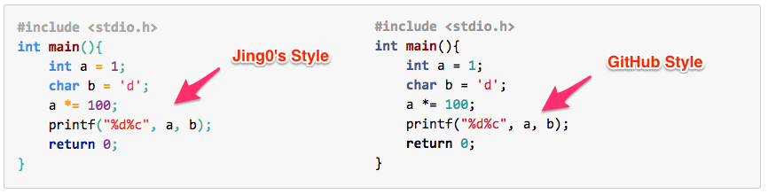

# MD2HTML

a C implementation of the Markdown to HTML system with code highlighting support.

## Supported

* `Customized CSS`
* `Headers` ( from # to #### )
* `Part Separator`( --- ).
* `Link` ( (name)[url] )
* `Blockquote` ( > )
* `Image` ( !(name)[url] )
* `Italic Style` ( *some text* )
* `Bold Style` ( **some text** )
* `Code` ( ` some text ` )
* `Code Block` ( '\t' some text )
* `List` ( * item )
* new! Support code highlighting with 2 styles(C, C++)

## ToDo

* and so and forth

##Examples

#### Headers:
	# 1st header
	## 2nd header
	### 3rd header
	#### 4th header
	##### 5th header
	###### 6th header

#### Part Separator:
	---
	----

#### Links:
	[name](example.com/)

#### Quotes:
	> quotes
	> quotes

#### Images:
	

#### Inline formating:
	**bold test** and *italics*.
	
#### Code:
	`some code`
	
#### Code Block:
		some code
		some code
	
#### Lists:
	* item1
	* item2
	
License (GNU AGPLv3)

MD2HTML - a C implementation of the Markdown to HTML system with code highlighting support.

Copyright (c) 2014-2015 Jackie Kuo

This program is free software: you can redistribute it and/or modify it under the terms of the GNU Affero General Public License as published by the Free Software Foundation, either version 3 of the License, or (at your option) any later version.

This program is distributed in the hope that it will be useful, but WITHOUT ANY WARRANTY; without even the implied warranty of MERCHANTABILITY or FITNESS FOR A PARTICULAR PURPOSE. See the GNU Affero General Public License for more details.

You should have received a copy of the GNU Affero General Public License along with this program. If not, see http://www.gnu.org/licenses/.
